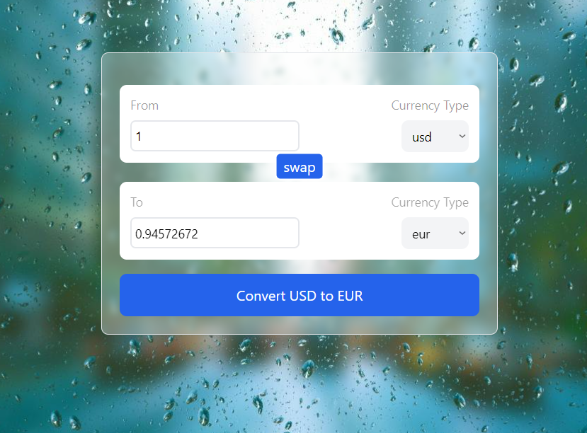

# Currency Converter

A React-based **Currency Converter** application that allows users to convert amounts between various currencies in real-time using exchange rates fetched from an external API.

## Features
- Input currency amount to convert.
- Select source and target currencies from dropdowns.
- Real-time conversion of currencies.
- Swap functionality to quickly reverse the source and target currencies.
- Responsive UI with Tailwind CSS for styling.

---

## Preview



## API Used
This project fetches real-time currency conversion rates from Currency API.

Example API Endpoint:

    ```bash
    https://latest.currency-api.pages.dev/v1/currencies/{currency}.json

    ```
Where {currency} is the source currency code (e.g., usd, eur, etc.).


## How It Works

### Custom Hook (`useCurrencyInfo`):
- Fetches conversion rates for a given source currency from the API.
- Stores the conversion rates as a JavaScript object.
- Updates data whenever the source currency changes.

### InputBox Component:
- Provides input fields for the amount and currency selection.
- Updates parent states when the user changes values.

### Main Application Logic:
- `convert` function calculates the converted amount using the selected currency's conversion rate.
- `swap` function swaps the source and target currencies while maintaining the current values.


## Installation and Setup
1. **Clone the repository:**
   ```bash
   git clone https://github.com/your-username/currency-converter.git
   cd currency-converter

2. **Install dependencies:**

   ```bash
   npm install
   ```

3. **Start the development server:**

   ```bash
   npm start
   ```

4. Open your browser and navigate to http://localhost:3000.


